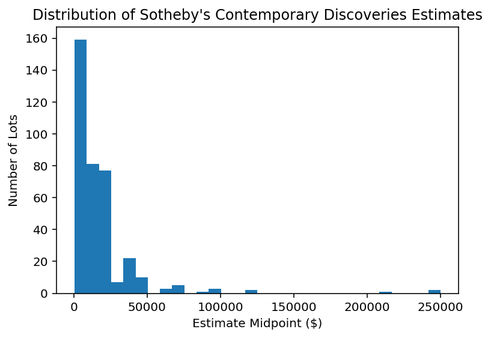
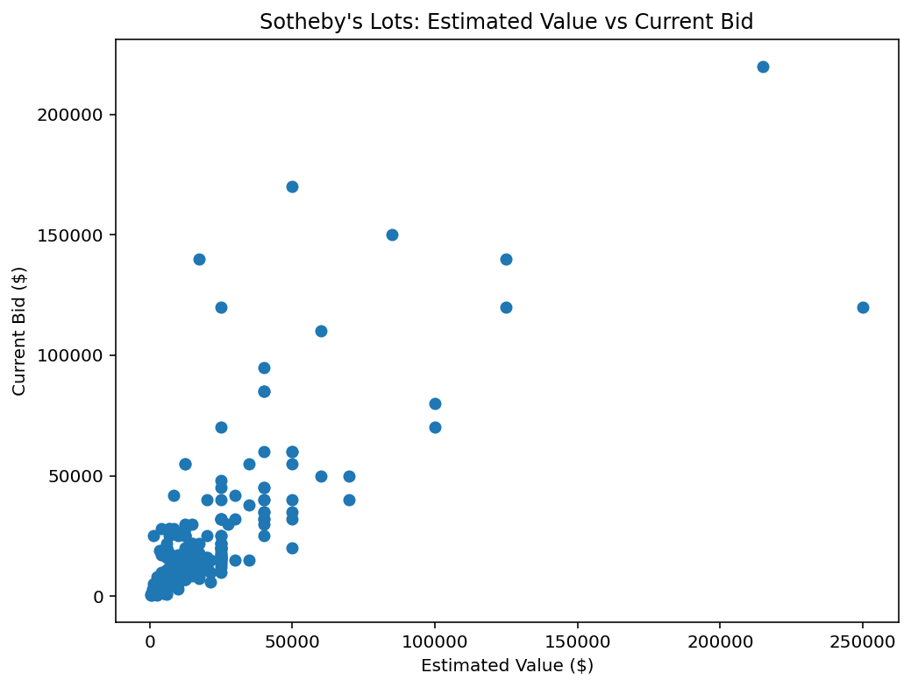

# Sotheby's Contemporary Discoveries Auction Analysis

## Overview

This project analyzes Sotheby's Contemporary Discoveries auction data to understand pricing trends, artist representation, and bidding activity.

I built a Python data pipeline that:
- Scraped auction lot data from Sotheby's GraphQL API
- Collected 373 contemporary art lots
- Analyzed estimates, bidding activity, and market interest

## Data Collection

Data was collected using:
- Python
- Requests
- GraphQL API queries

The dataset includes:
- Artist
- Lot title
- Estimate range
- Current bid
- Number of bids
- Reserve status

## Analysis Performed

The project explores:

### Pricing Analysis
- Estimate midpoint calculations
- Highest valued lots
- Estimate distributions

### Artist Analysis
- Most represented artists
- Average estimate by artist
- Artist-level market trends

### Auction Activity
- Number of bids per lot
- Bid-to-estimate ratios
- Auction momentum scoring

## Key Metrics

Dataset size:
- 373 auction lots
- 330 lots with active bidding data

## Key Findings

Analysis of 373 Sotheby's Contemporary Discoveries auction lots revealed:

- The average estimated value per lot was approximately $18.5K, with estimates ranging from $600 to $250K.
- A small number of high-value works drove a large portion of the auction's estimated value.
- Bidding activity varied significantly, with active lots receiving up to 56 bids.
- Several works showed strong demand, with current bids exceeding estimated values by multiple times.
- Artist-level analysis identified artists with both high representation and higher average estimated values.
- Bid-to-estimate ratios helped identify lots generating above-average market interest.

## Visualizations

### Estimate Distribution



### Bid Activity vs Estimated Value



## Tools

- Python
- Pandas
- Matplotlib
- Requests
- BeautifulSoup
- OpenPyXL

## Project Structure

```
sothebys-auction-analysis/
│
├── sothebys_scraper.py
├── sothebys_analysis.py
├── sothebys_contemporary_discoveries.xlsx
├── requirements.txt
└── README.md
```

## Future Improvements

Potential next steps:
- Add auction result data after sale completion
- Compare estimate accuracy versus final hammer prices
- Build predictive models for auction performance
- Create an interactive dashboard
